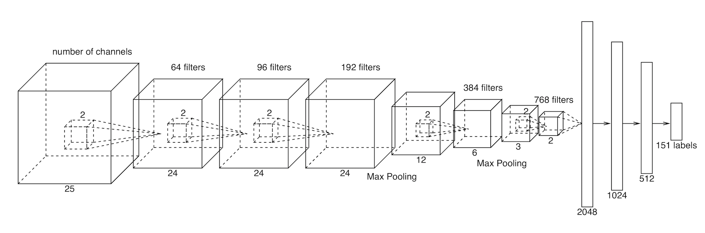

# ProLig

This is the source code for **ProLig**, a 3D computer vision research project I have worked on before. 

ProLig is a classifier for predicting binding drug molecules for target proteins. Given a 3D image of protein pocket, it can predict its binding drugs among 151 different classes. ProLig was trained on a 3D deep convolutional neural network, which was developed by myself. The diagram of the neural network architecture is as follows:



The source code is in the subdirectory `./src/`, and the sample dataset is in `./data/data_10classes.tar.gz`.

The whole dataset contains 151 classes and it is very big. Here I only include a sample dataset of 10 classes.

The dataset included here is split into the training set and the test set. 

All the examples are 2-channel 3D images of size 25-by-25-by-25-by-2. 

Examples in the training set were encoded in `.tfrecords` files. This is the standard TensorFlow file format. The training files were numbered sequentially as `train_0.tfrecords`, `train_1.tfrecords`, etc. `train_0.tfrecords` contains the first 5000 examples in `trainIDs.list`, `train_1.tfrecords` contains the second 5000, etc. For the test set, examples were stored in HDF5 format. 

## How to run the code
**Python version**: The code was written in Python 2. So please use Python 2 to run the code and do NOT use Python 3.

**TensorFlow version**: The code was written using the TensorFlow deep learning framework. At the time the code was written, the latest version of TensorFlow was r0.12. So my code is fully compatible with this version. I tested on newer versions but unfortunately there are some functions deprecated. So please use version r0.12 or you may modify those deprecated functions yourself. 

**GPU requirement**: The code was designed to run on a GPU with sufficient memory. It worked on Nvidia Tesla K40c, Titan X, and GeForce GTX 1080 Ti. 

**Python library dependency**: numpy, scipy, pandas, sklearn, h5py

### Model training
To train the model:
```
cd ./src
python script_train.py
```
Using the default setting in `script_train.py`, running the code will save checkpoint files every 1000 steps in `./checkpoints/` and will also save a summary file in `./summaries/`. The (intermidiate) models are saved in those checkpoint files. If you want to visualize the summaries, you may use `tensorboard`.

To test the model using the test set, you may want to specify which step of the checkpoint file you want to use by setting `step` parameter in the `./code/test.py` file, or you may leave it as the default, which was set to 10000 steps.
```
python test.py
```
This will print the overall results on the screen as well as writing the detailed results in an excel file in the folder `./results/`.


